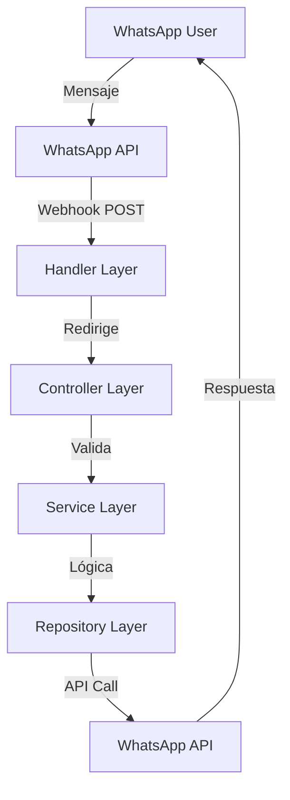

# 🏋️ WhatsApp Fitness Bot - Backend

## 📁 Arquitectura del Proyecto

```
backend/
├── config/          # ⚙️ Configuración centralizada
│   └── settings.py  # Variables de entorno y configuración
│
├── domain/          # 📦 Modelos y estructuras de datos
│   └── models.py    # Pydantic models (DTOs)
│
├── repository/      # 🔌 Capa de acceso a servicios externos
│   └── whatsapp_repository.py  # Interacción con WhatsApp API
│
├── service/         # 🧠 Lógica de negocio
│   └── whatsapp_service.py  # Procesamiento de mensajes
│
├── controller/      # 🎮 Manejo de requests
│   └── webhook_controller.py  # Validación y preparación de datos
│
├── handler/         # 🚪 Endpoints de la API
│   └── webhook_handler.py  # Rutas FastAPI
│
└── main.py          # 🚀 Punto de entrada
```

## 🎯 Flujo de la Aplicación



## 🚀 Inicio Rápido

### 1. Configurar variables de entorno

Crea un archivo `.env` en la raíz del proyecto:

```bash
# WhatsApp Business API
WHATSAPP_TOKEN=tu_token_aqui
WHATSAPP_PHONE_ID=tu_phone_id_aqui
VERIFY_TOKEN=tu_verify_token_secreto

# Aplicación
APP_ENV=development
PORT=8000
LOG_LEVEL=INFO

# Features (actívalas cuando las implementes)
ENABLE_IMAGE_PROCESSING=false
ENABLE_AI_RESPONSES=false
```

### 2. Instalar dependencias

```bash
pip install -r requirements.txt
```

### 3. Ejecutar la aplicación

```bash
# Desarrollo (con auto-reload)
python main.py

# O con uvicorn directamente
uvicorn main:app --reload --port 8000
```

### 4. Verificar que funciona

- Documentación Swagger: http://localhost:8000/docs
- Health Check: http://localhost:8000/health
- Info: http://localhost:8000/

## 📍 Dónde agregar tu código

### 🧠 Lógica de Fitness/IA

**Archivo:** `service/whatsapp_service.py`
**Función:** `_generate_text_response()`

```python
# Aquí es donde agregas tu lógica de IA
async def _generate_text_response(self, text: str) -> str:
    # TODO: Conectar con tu modelo de IA
    # TODO: Procesar comandos de fitness
    # TODO: Generar respuestas personalizadas
```

### 🖼️ Procesamiento de Imágenes

**Archivo:** `service/whatsapp_service.py`
**Función:** `_handle_image_message()`

```python
# Aquí procesas las fotos de comida
async def _handle_image_message(self, sender: str, image_data: Dict):
    # TODO: Descargar imagen
    # TODO: Analizar con visión por computadora
    # TODO: Calcular calorías
```

### 🗄️ Base de Datos (si la necesitas)

**Crear nuevo archivo:** `repository/database_repository.py`

```python
class DatabaseRepository:
    async def save_user_progress(self, user_id: str, data: dict):
        # TODO: Guardar en MongoDB/PostgreSQL/etc
        pass
```

### 🤖 Nuevos comandos

**Archivo:** `service/whatsapp_service.py`
**Función:** `_generate_text_response()`

Agrega más comandos aquí siguiendo el patrón existente.

## 🔧 Endpoints Disponibles

### Webhooks

- `GET /webhook` - Verificación de WhatsApp
- `POST /webhook` - Recepción de mensajes

### Utilidades

- `POST /send-test-message` - Enviar mensaje de prueba
- `POST /send-menu` - Enviar menú principal
- `POST /broadcast` - Envío masivo
- `GET /health` - Estado del servicio

## 💡 Tips para el Hackathon

### 1. **Prioriza funcionalidad sobre perfección**

- Implementa las features básicas primero
- Agrega IA/ML al final si tienes tiempo

### 2. **Usa los logs**

```python
logger.info("🔍 Debugging aquí")
```

### 3. **Test rápido con ngrok**

```bash
ngrok http 8000
```

Usa la URL de ngrok como webhook en WhatsApp

### 4. **Estructura para escalar**

- Cada servicio en su archivo
- Cada repositorio para una conexión externa
- Controllers validan, Services procesan

### 5. **Features rápidas de implementar**

- Comandos de texto simples
- Menús interactivos
- Respuestas predefinidas
- Registro de peso/progreso en memoria

## 🎨 Personalización Rápida

### Cambiar respuestas del bot

Ve a `service/whatsapp_service.py` y modifica los textos en las funciones `_generate_text_response()` y relacionadas.

### Agregar nuevos tipos de mensaje

1. Agrega el tipo en `domain/models.py`
2. Agrega el handler en `service/whatsapp_service.py`
3. Procesa en `_handle_message_by_type()`

### Conectar base de datos

1. Crea `repository/database_repository.py`
2. Inyecta en `service/whatsapp_service.py`
3. Usa en las funciones de procesamiento

## 🐛 Debugging

### Ver todos los logs

```python
# En config/settings.py
LOG_LEVEL = "DEBUG"
```

### Probar sin WhatsApp

Usa los endpoints de test:

```bash
curl -X POST "http://localhost:8000/send-test-message" \
  -H "Content-Type: application/json" \
  -d '{"phone_number": "+521234567890", "message": "Test"}'
```

### Verificar webhook manualmente

```bash
curl "http://localhost:8000/webhook?hub.mode=subscribe&hub.verify_token=tu_verify_token_secreto&hub.challenge=123"
```

## 📚 Recursos

- [WhatsApp Business API Docs](https://developers.facebook.com/docs/whatsapp/business-api)
- [FastAPI Docs](https://fastapi.tiangolo.com/)
- [Pydantic Docs](https://pydantic-docs.helpmanual.io/)

## 🏆 ¡Éxito en el Hackathon!

Recuerda: **Simple, Funcional, Escalable** 🚀
