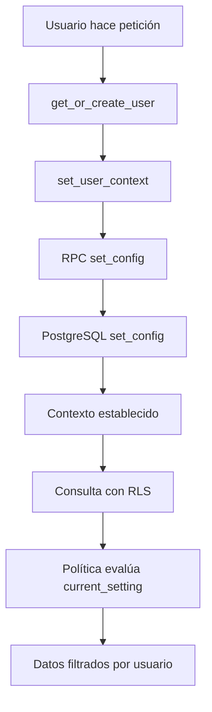

# Fix para Error de set_config en Supabase RLS

## 🐛 Problema

El sistema está mostrando el siguiente error:

```
2025-08-24 03:20:11,163 - httpx - INFO - HTTP Request: POST https://oeebbithjxdpowiwzkdm.supabase.co/rest/v1/rpc/set_config "HTTP/2 404 Not Found"
2025-08-24 03:20:11,164 - repository.supabase_client - WARNING - ⚠️ No se pudo establecer contexto de usuario: {'message': 'Could not find the function public.set_config(is_local, new_value, setting_name) in the schema cache', 'code': 'PGRST202', 'hint': None, 'details': 'Searched for the function public.set_config with parameters is_local, new_value, setting_name or with a single unnamed json/jsonb parameter, but no matches were found in the schema cache.'}
```

## 🔍 Causa del Problema

1. **Row Level Security (RLS)**: El sistema usa RLS para seguridad de datos
2. **Contexto de Usuario**: Las políticas RLS necesitan saber qué usuario está haciendo la consulta
3. **Función Faltante**: La función `set_config` no existe en la base de datos de Supabase
4. **PostgreSQL vs Supabase**: `set_config` es una función nativa de PostgreSQL, pero no está expuesta como RPC en Supabase por defecto

## 🔧 Solución

### Paso 1: Crear la Función en Supabase

Ejecuta el siguiente SQL en **Supabase SQL Editor**:

```sql
CREATE OR REPLACE FUNCTION set_config(setting_name text, new_value text, is_local boolean DEFAULT false)
RETURNS text AS $$
BEGIN
    PERFORM set_config(setting_name, new_value, is_local);
    RETURN new_value;
END;
$$ LANGUAGE plpgsql SECURITY DEFINER;
```

### Paso 2: Verificar las Políticas RLS

Las políticas RLS en el esquema usan `current_setting('app.current_user_id', true)`:

```sql
-- Ejemplo de política
CREATE POLICY "Users can manage their own profile" ON users
    FOR ALL USING (id::text = current_setting('app.current_user_id', true));
```

### Paso 3: Cómo Funciona el Contexto

1. **Establecer Contexto**: Antes de cada operación, se llama a `set_user_context(user_id)`
2. **Función RPC**: Esto ejecuta `set_config('app.current_user_id', user_id, true)`
3. **Políticas RLS**: Las políticas usan `current_setting('app.current_user_id', true)` para filtrar datos

## 📋 Pasos para Aplicar el Fix

### Opción A: Ejecutar SQL Manualmente (Recomendado)

1. Ve a tu proyecto de Supabase
2. Abre **SQL Editor**
3. Copia y pega el SQL de arriba
4. Ejecuta la consulta
5. Reinicia tu aplicación

### Opción B: Usar el Script de Diagnóstico

```bash
python3 fix_set_config_function.py
```

Este script:

- Verifica si la función existe
- Muestra el SQL necesario
- Prueba el contexto de usuario

## 🚨 ACTUALIZACIÓN: Fix Completo para RLS

**IMPORTANTE**: Además de la función `set_config`, también necesitas actualizar las políticas RLS para que funcionen correctamente con INSERT operations.

### SQL Completo para Aplicar:

```sql
-- 1. ELIMINAR POLÍTICAS EXISTENTES
DROP POLICY IF EXISTS "Users can manage their own profile" ON users;
DROP POLICY IF EXISTS "Users can manage their own workouts" ON workouts;
DROP POLICY IF EXISTS "Users can manage sets from their workouts" ON workout_sets;

-- 2. CREAR FUNCIÓN SET_CONFIG
CREATE OR REPLACE FUNCTION set_config(setting_name text, new_value text, is_local boolean DEFAULT false)
RETURNS text AS $$
BEGIN
    PERFORM set_config(setting_name, new_value, is_local);
    RETURN new_value;
END;
$$ LANGUAGE plpgsql SECURITY DEFINER;

-- 3. POLÍTICAS SEPARADAS POR OPERACIÓN
-- Users
CREATE POLICY "Users can view their own profile" ON users FOR SELECT USING (id::text = current_setting('app.current_user_id', true));
CREATE POLICY "Users can create profile" ON users FOR INSERT WITH CHECK (id::text = current_setting('app.current_user_id', true));
CREATE POLICY "Users can update their own profile" ON users FOR UPDATE USING (id::text = current_setting('app.current_user_id', true)) WITH CHECK (id::text = current_setting('app.current_user_id', true));
CREATE POLICY "Users can delete their own profile" ON users FOR DELETE USING (id::text = current_setting('app.current_user_id', true));

-- Workouts
CREATE POLICY "Users can view their own workouts" ON workouts FOR SELECT USING (user_id::text = current_setting('app.current_user_id', true));
CREATE POLICY "Users can create workouts" ON workouts FOR INSERT WITH CHECK (user_id::text = current_setting('app.current_user_id', true));
CREATE POLICY "Users can update their own workouts" ON workouts FOR UPDATE USING (user_id::text = current_setting('app.current_user_id', true)) WITH CHECK (user_id::text = current_setting('app.current_user_id', true));
CREATE POLICY "Users can delete their own workouts" ON workouts FOR DELETE USING (user_id::text = current_setting('app.current_user_id', true));

-- Workout Sets (políticas similares pero más largas - ver esquema completo)
```

## 🧪 Verificar que Funciona

Después de aplicar el fix completo, deberías ver:

1. **Contexto establecido**:

```
🔐 Contexto de usuario establecido: 123e4567-e89b-12d3-a456-426614174000
```

2. **Sin errores de RLS**:

```
✅ Rutina iniciada: workout-123 para usuario user-456
```

3. **No más errores como**:

```
❌ new row violates row-level security policy for table "workouts"
```

## ⚠️ Consideraciones Importantes

1. **Seguridad**: La función usa `SECURITY DEFINER` para permitir que los usuarios establezcan configuraciones de sesión
2. **Sesión**: El contexto se establece por sesión/conexión
3. **RLS**: Sin contexto, las políticas RLS pueden bloquear todas las consultas
4. **Performance**: El contexto se establece antes de operaciones que lo requieren

## 🔄 Flujo Completo



## 📝 Archivos Modificados

- `database/schema.sql` - Agregada función set_config
- `repository/supabase_client.py` - Mejorado manejo de errores
- `fix_set_config_function.py` - Script de diagnóstico

## 🎯 Resultado Esperado

Después del fix:

- ✅ No más errores 404 de set_config
- ✅ RLS funciona correctamente
- ✅ Usuarios solo ven sus propios datos
- ✅ Logs informativos en lugar de warnings
