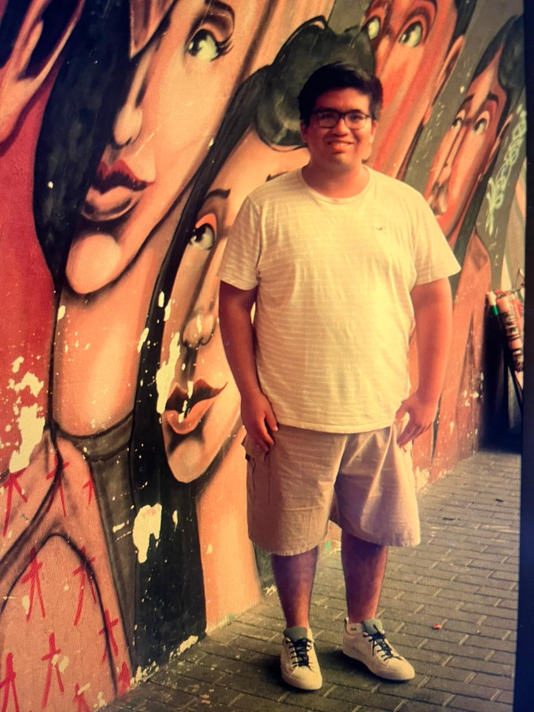
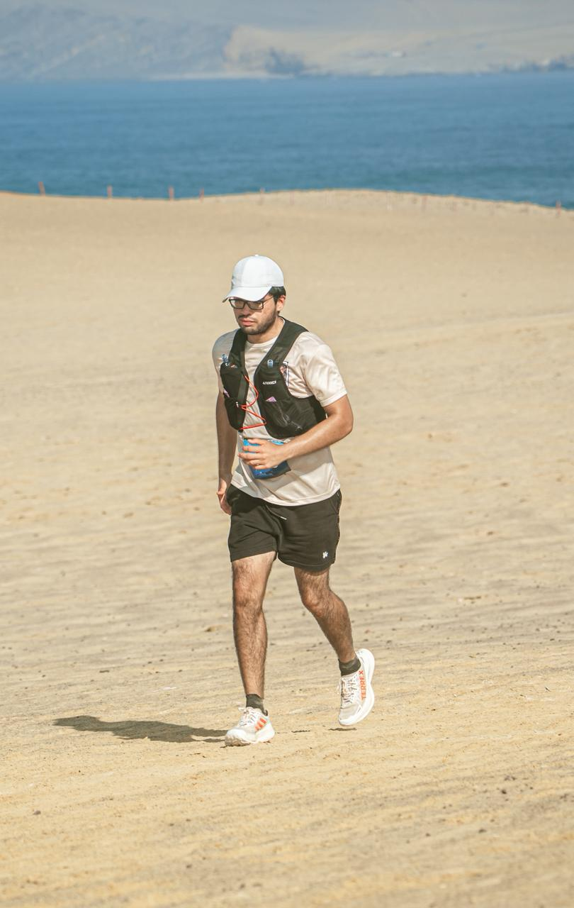

# FaiTracker

## El primer health coach en WhatsApp para LatAm

**62% de adultos en LatAm tienen sobrepeso**  
**Solo 26% hace ejercicio regularmente**

---

# El Problema

**La gente sabe qué hacer, pero no lo cumple**

- Nutricionistas pierden pacientes por falta de adherencia
- Apps fitness tienen baja retención (<10% a 3 meses)
- Barreras de adopción: nuevas apps, interfaces complejas

**WhatsApp ya está en el bolsillo de 92% de usuarios en LatAm**

---

# Solución

**Health tracking nativo en WhatsApp**

- Registro de comidas por texto
- Tracking de entrenamientos
- Recomendaciones personalizadas por IA
- Accountability en tiempo real para nutricionistas

**Zero friction. Maximum adherence.**

---

# Mercado

**USD 20.7B** mercado fitness apps en 2028 (CAGR 23.5%)

**459M usuarios** con internet móvil en LatAm para 2025

**Opportunity gap**: No existe un player dominante en WhatsApp health coaching en LatAm

---

# Producto

**Dual Platform:**

1. **WhatsApp Bot** - Pacientes registran comidas/ejercicios
2. **Web Dashboard** - Nutricionistas monitorean progreso

**Stack**: Python + Supabase + WhatsApp Business API + OpenAI

---

# Business Model

**B2B Primary**: USD 15/mes por paciente activo (nutricionistas)

**B2C Premium**: USD 9.99/mes (coaching IA avanzado)

**Target**: 1,000 nutricionistas x 20 pacientes = USD 300K MRR

---

# Competencia

**MyFitnessPal, Cronometer**: Apps standalone, no WhatsApp native

**Nutrium, FoodNoms**: B2B tools sin consumer engagement

**WhatsApp Business**: No tiene health-specific features

**Ventaja**: First mover en WhatsApp health coaching LatAm

---

# Founder: Transformación Personal

 

**ANTES: +50kg** &nbsp;&nbsp;&nbsp;&nbsp;&nbsp;&nbsp;&nbsp;&nbsp;&nbsp;&nbsp;&nbsp;&nbsp; **DESPUÉS: Transformación**

**Sebastián Chávarry** - Viví el problema que estoy resolviendo

---

# Founder: Credenciales

**Sebastián Chávarry**

- **Segundo puesto** Ingeniería de Sistemas - Universidad de Lima
- **Transformación personal**: Perdió +50kg por su cuenta
- **2 años** como Software Engineer
- **AWS re:Inforce 2024** ABW Grant Alumni
- **Coding Makers Fellow**

**Personal + Technical expertise para resolver este problema**

---

# Demo & Next Steps

**Hackathon MVP**: Prototipo funcional en 24h

**Tech Stack**: Python + Supabase + WhatsApp Business API + OpenAI

**Next Steps**: Validar con nutricionistas reales y expandir features

---

# Impact & Vision

**Impacto**: Mejorar adherencia nutricional del 26% al 80%+ usando WhatsApp

**Visión**: Convertir WhatsApp en el canal #1 de salud preventiva en LatAm

**Demo live en WhatsApp disponible ahora**
